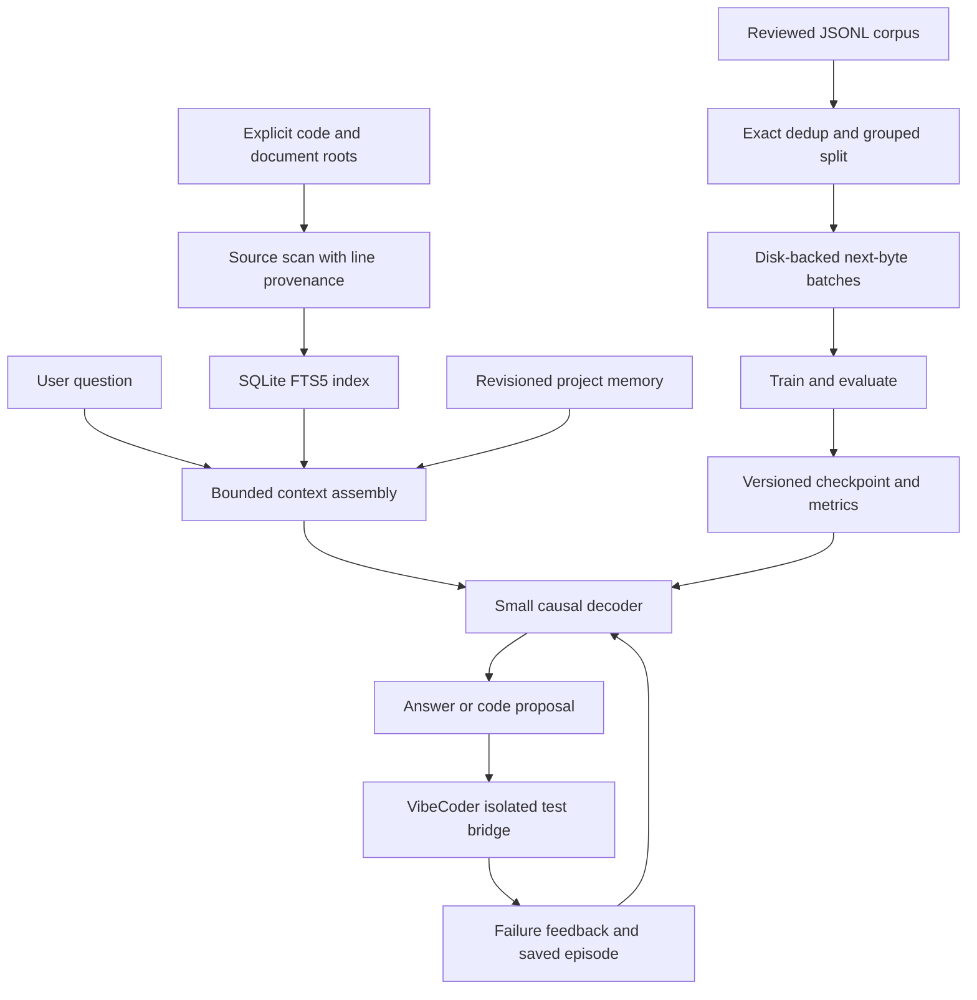

# Architecture and experiment contract

## Contracts

- `tokenizer.py`: 256 byte tokens + PAD/BOS/EOS/SEP = 260 vocabulary entries.
  UTF-8 code and documents round-trip without fitted vocabulary or downloads.
- `model.py`: pre-normalized decoder blocks, causal SDPA, GELU feed-forward,
  learned positional embeddings and tied output projection. Defaults have no
  experimental gate. Right-padding is excluded by target masking and cannot
  affect earlier positions through causal attention.
- `data.py`: BOS/text/EOS or BOS/prompt/SEP/completion/EOS; targets shifted exactly
  once. Prompt and PAD labels are `-100`. Distinct documents never share a block.
- `training.py`: loss weighted by supervised target count across microbatches;
  each optimizer step consumes a complete accumulation group. RNG/config/data
  hashes support reproducible resume. Only tensor/primitive checkpoints are loaded
  with `weights_only=True`; no remote model classes are imported.
- `workspace.py` / `memory.py`: explicit directory roots, source-file allowlist,
  symlink exclusion, ingestion budgets, SQLite transactions, searchable code fences,
  path/line references, and explicit memory revisions. This is a local source-access
  boundary, not a general security sandbox against other processes of the same user.
- `assistant.py`: source context is bounded before generation. Model output is a
  proposal and is not parsed as permission to run tools. Patch generation produces
  a diff only. No pretrained model is needed for retrieval-only use.
- `vibecoder_bridge.py`: explicitly trusted local plugin import; all generated code
  requires an isolated backend. Neither a reference solution nor hidden test code
  is put into the initial task prompt. Repair feedback exposes failing-case results.
- `hub.py`: public metadata and a single chosen data file, immutable revision,
  byte cap, SHA-256 receipt, no remote Python execution or implicit training admission.

## Experimental gate

After normalizing each token's representation `h`, compute:

`x_next = x + FF(h) * (2 * sigmoid(W h + b))`

`W` and `b` start at zero, so the multiplier starts at one. Creating the gate
preserves the RNG state used by the baseline, enabling identical common weights
under paired seeds. The gate operates independently at each token; it cannot pool
information from future tokens. Tests verify causal invariance and checkpointed
gradient equivalence. Gate parameters are additional capacity, reported explicitly.

This gate is an experiment in residual modulation, not a measurement of consciousness
or a claim that dimensional coherence replaces data or compute. The initial single-seed
smoke experiment slightly favored the baseline; no improvement is claimed.

## Evaluation boundaries

Validation reports token-weighted cross entropy and byte-token perplexity, including
EOS. These are not directly comparable to perplexity from another tokenizer. During
training, evaluation is capped by `eval_batches`; `evaluate` defaults to the full
held-out split. The smoke fixture is a machinery check, not a coding benchmark.

Exercise success means the generated function passed the selected cases and, after
repair success, a fresh-seed check. It does not establish broad coding competence.
Entire task families must be held out; file/group IDs cannot detect semantic leakage.

## Upstream implementation references

- [PyTorch SDPA](https://docs.pytorch.org/docs/main/generated/torch.nn.functional.scaled_dot_product_attention.html):
  causal attention and explicitly zero attention dropout during evaluation.
- [PyTorch activation checkpointing](https://docs.pytorch.org/docs/2.14/checkpoint.html):
  explicit `use_reentrant=False`.

No external service is used by normal model, training, retrieval, or memory commands.
