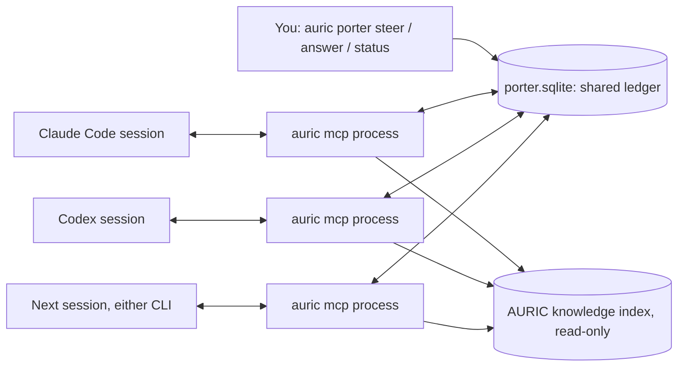

# Porter: one direction for concurrent Claude Code and Codex sessions

When Claude Code and Codex work on the same project at the same time, each one sees
only its own conversation. They can edit the same file, make opposite decisions, and
drift from what you asked for. Porter gives them a shared ledger and gives you one
place to steer them.

- **You** set directives (priorities, constraints, scope, protected paths), answer
  questions, and see every session from your terminal: `auric porter ...`.
- **Agents** call Porter tools over MCP: check in, read your directives, claim files
  before editing, leave notes, message each other, ask you questions, and hand off.
- **The next session** gets the previous session's handoff summary, your decisions,
  and messages left for it, whichever CLI it runs in.



Each CLI session launches its own `auric mcp` process. The processes share one SQLite
ledger (WAL mode; claims are checked and written in one `BEGIN IMMEDIATE` transaction,
so two sessions cannot both win the same file). No network service, no daemon, no
dependencies beyond the Python standard library.

## Setup

Already done on this machine (2026-09-29):

```bash
codex mcp add auric --env PYTHONPATH=/home/kill/patern-coding -- python3 -m auric mcp
claude mcp add --scope user auric --env PYTHONPATH=/home/kill/patern-coding -- python3 -m auric mcp
```

Both are registered globally, so Porter is available in every project; the ledger keys
everything by project (the enclosing Git root). Check with `claude mcp get auric` and
`codex mcp get auric`. Undo with `claude mcp remove auric -s user` and
`codex mcp remove auric`. Restart open sessions to pick up the tools.

The `porter` skill (`/porter` in Claude Code, `$porter` in Codex) lives in
`.agents/skills/porter/`, with `.claude/skills/porter` as a symlink, so both CLIs
discover it inside this repository. To use it in every project, link it the same way
as COMPuLSION:

```bash
ln -s /home/kill/patern-coding/.agents/skills/porter ~/.agents/skills/porter
ln -s /home/kill/patern-coding/.agents/skills/porter ~/.claude/skills/porter
```

`AGENTS.md` (read by Codex; imported by `CLAUDE.md` for Claude Code) tells agents in
this repository to follow the protocol.

## Your controls

Run from anywhere inside the project, or pass `--project PATH`.

```bash
auric porter status                                  # directives, questions for you, sessions, recent notes
auric porter steer "Priority: corpus pipeline before model changes"
auric porter steer "Work only in auric/, docs/, tests/" --kind scope --paths auric docs tests
auric porter steer "Leave the Julia project alone" --kind protect --paths MessageVectorizer
auric porter steer "Small, reviewable patches" --kind preference --global
auric porter answer 3 "Hold out all of week 3"       # every session is notified
auric porter say "Pause edits; I'm rebasing" --to codex
auric porter retire 2
auric porter end codex-4f74                          # release a stuck session's claims
auric porter history "leakage"                       # search notes, decisions, answers
auric porter watch                                   # live feed; good in a third terminal pane
```

Use `python -m auric` in place of `auric` if the package is not installed.

Directive kinds, in the order agents see them:

| Kind | Effect |
| --- | --- |
| `priority` | Ordered goals. Agents are told these outrank their own plan. |
| `scope` | Path patterns. When any exist, claims outside all of them are **denied**. |
| `protect` | Path patterns. Claims on, inside, or containing them are **denied**. |
| `constraint` | Rules the work must follow. |
| `preference` | How you like things done. |

Patterns are project-relative: `auric` (directory and everything under it),
`tests/test_*.py`, `keys/*.pem`. `--global` applies a directive to every project.

## Agent tools

| Tool | Use |
| --- | --- |
| `porter_checkin` | Register with a task and `cwd`; returns the brief. Re-call to update the task. |
| `porter_brief` | Directives (new ones flagged), other live sessions and claims, questions waiting on you, your decisions, handoffs, inbox, guidance. |
| `porter_inbox` | Only what is new: answers, directive changes, messages. |
| `porter_claim` / `porter_release` | Claim files or directories before editing. All-or-nothing. |
| `porter_note` | `progress`, `decision`, `finding`, `blocker`, `test`, or `handoff`, with evidence. |
| `porter_message` | To a session id, an agent name (queued for that agent's next reader), `*`, or `user`. |
| `porter_ask_user` | Queue a decision for you with options and context; the agent continues other work. |
| `porter_checkout` | Summary and next steps; releases claims; becomes the next session's handoff. |
| `porter_history` | Search the project's coordination history. |
| `auric_search` / `auric_memories` | Read the local AURIC knowledge index and your confirmed memories. |

The server also sends short usage instructions during the MCP handshake. Claude Code
shows them to the model; `AGENTS.md` and the skill cover the rest.

## Semantics worth knowing

- **Sessions.** One MCP process = one session, named `<agent>-<hex>` (the agent is
  detected from the client: `claude-code`, `codex`). A session registers on its first
  tool call. When the CLI exits, the server ends the session and releases its claims.
  A session also counts as dead if its server process is gone (checked by PID on this
  host) or it has been silent longer than `AURIC_PORTER_TTL_HOURS` (default 12). Dead
  sessions' claims are shown as stale and never block anyone.
- **Claims** are advisory coordination between cooperating agents, not file locks. An
  agent that ignores Porter can still edit anything. Claims name concrete files or
  directories (no globs); a directory claim overlaps everything inside it. A claim
  request is granted completely or not at all.
- **Delivery.** Messages to a session id or `*` reach live sessions once. Messages
  to an agent name wait for the next session of that agent to read its inbox, even one
  started tomorrow. Your answers and directive changes are broadcast to every session
  on the project, because your decisions bind all of them.
- **User-only actions.** Agents get no MCP tool to write directives or answers. An
  agent could still run `auric porter steer` through its shell. That is not blocked,
  but it is labelled: the ledger records `set from claude-code shell` (or `codex
  shell`), and both `status` and the agents' brief show it.
- **The base MCP protocol is pull-based.** The skill and `AGENTS.md` tell agents to
  check the inbox between steps. Optional [lifecycle reflexes](PORTER_REFLEXES.md)
  add automatic startup context, edit-lease checks, and compaction checkpoints;
  install and verify those adapters separately. There is no unsolicited peer-chat
  delivery or background message loop.

## Data and privacy

The ledger is `~/.local/share/auric/porter.sqlite` (override with `AURIC_PORTER_DB`,
or `--db` / `--porter-db`). It is unencrypted local text: tasks, notes, messages, your
directives and answers. Nothing leaves the machine. Porter never reads or writes
project files; it stores path strings. `auric_search` reads the knowledge index at
`artifacts/knowledge.sqlite` in this repository (override with `AURIC_KNOWLEDGE_DB`).
When no index exists, it tells the agent how you can build one.

## Verification

- `python -m unittest tests.test_porter`: 17 tests. They cover path rules, conflicts,
  scope and protect denial, dead-session claims, a six-way concurrent claim race with
  exactly one winner, delivery semantics, question and answer broadcast, directive
  notification, handoff carry-over, protocol errors and argument validation, and two
  real `auric mcp` subprocesses: one blocks the other, then its claim is freed when its
  client disconnects.
- Live on 2026-09-29, against a scratch ledger: `claude mcp get auric` reported
  Connected. `codex exec` (codex-cli 0.153.4) and `claude -p` (Claude Code 2.1.284)
  each called checkin, claim, note, brief, and checkout. The ledger identified them as
  `codex-5db4` and `claude-code-81d5`. Those two live runs did not overlap in time;
  simultaneous visibility is covered by the subprocess test.

## Possible next steps

- Activate and verify the implemented [Claude/Codex lifecycle hooks and pre-push
  consent gate](PORTER_REFLEXES.md) in the real clients. The adapter tests pass;
  live hook loading and shared MCP ownership still need evidence.
- A read-only web or TUI dashboard over the same ledger.
- Let accepted `decision` notes become AURIC memories on your confirmation, so the
  local assistant's retrieval sees the project's decisions.
